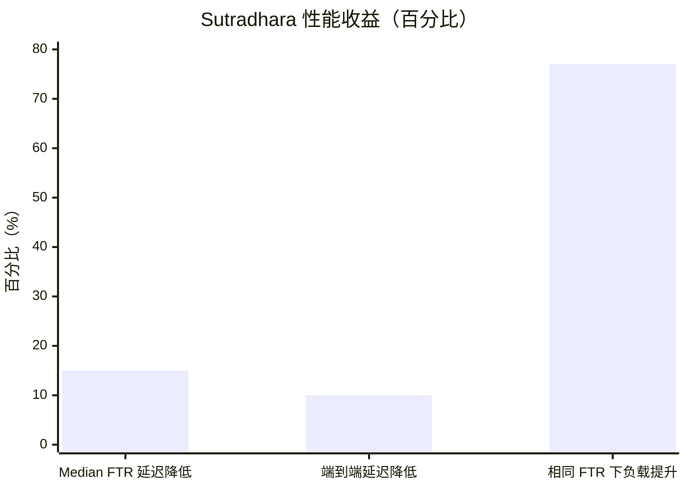
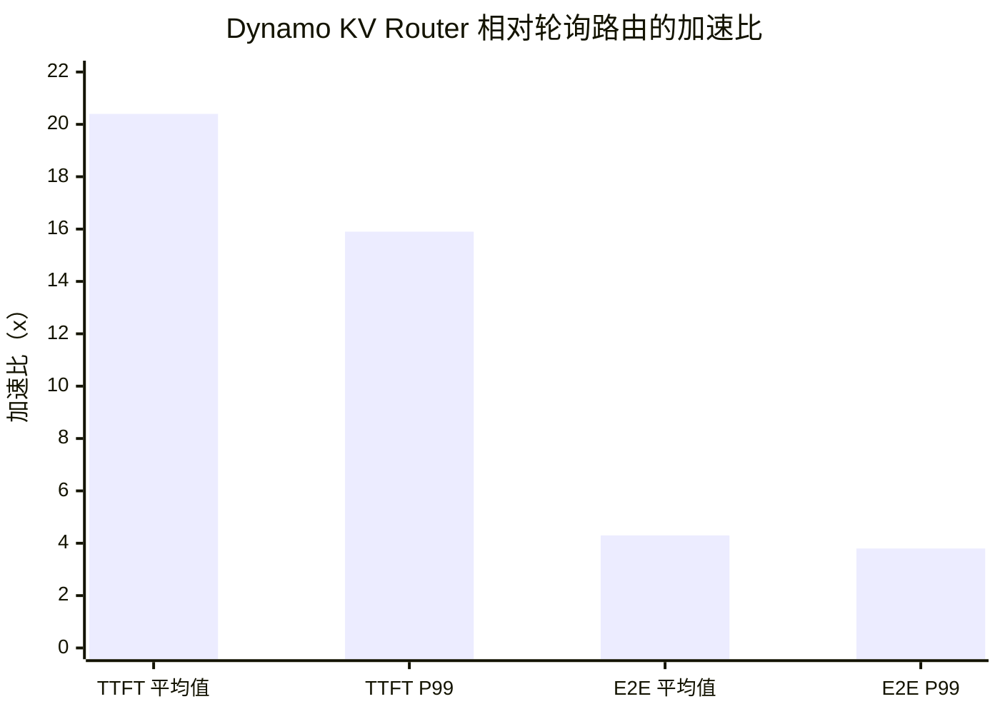
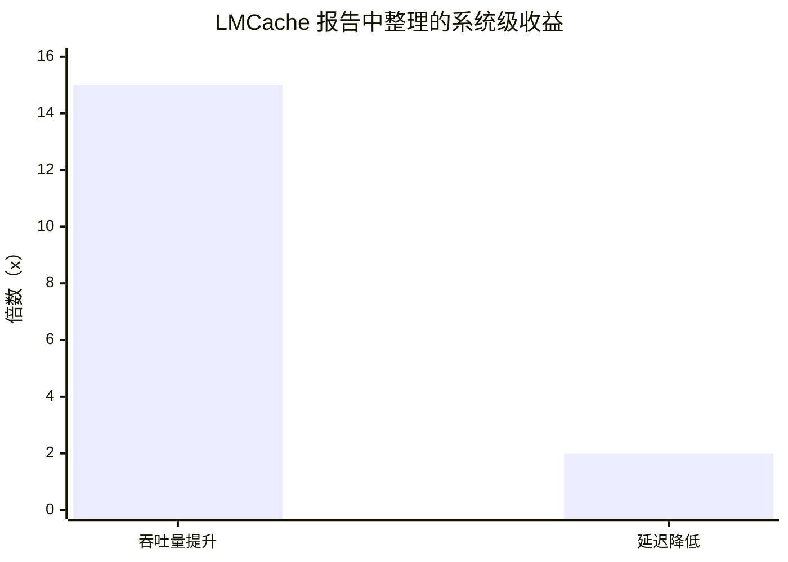
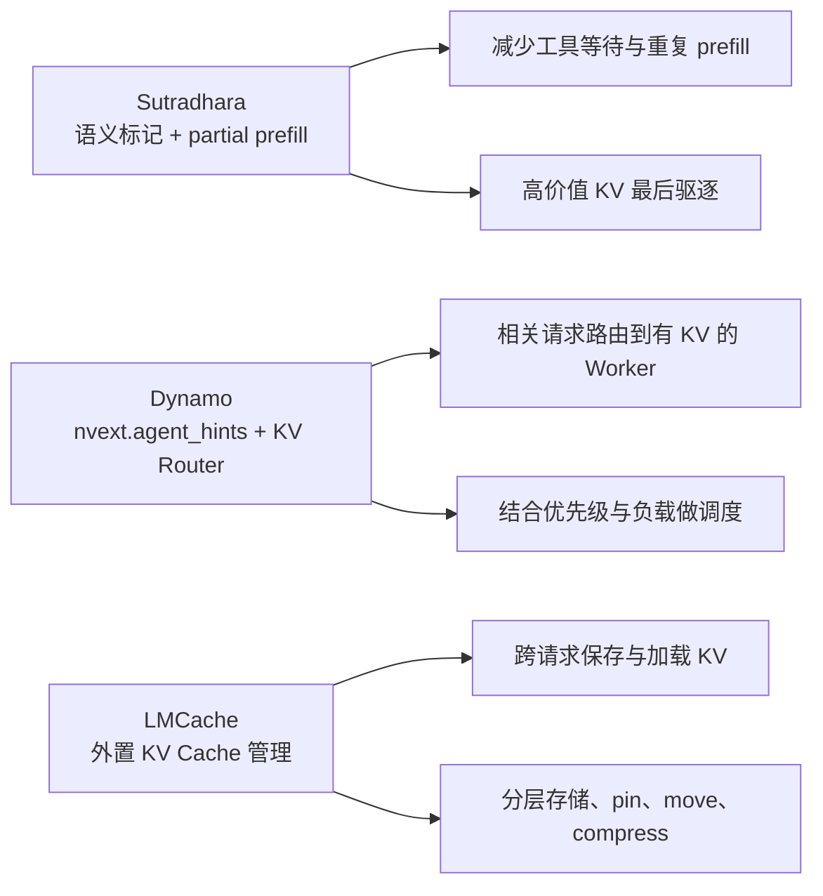

# Agent Hints 与 KV Cache 系统调研：Sutradhara、LMCache、Dynamo 对比

## 0. 资料来源与校验范围

本文分两类来源：

- **外部系统资料**：Sutradhara、NVIDIA Dynamo 的机制参考用户提供的调研报告 `c:\Users\yangwu\Downloads\Kimi_Agent_KVCache代理提示\report.md`，并补充核对了公开网络资料：Sutradhara arXiv HTML、Microsoft Research 发布页、NVIDIA Dynamo 官方 Agents 文档、NeMo Agent Toolkit 的 Dynamo LLM provider 源码/文档，以及 Dynamo Router README。[R1][R2][R3][R4][R5][R6][R7][R8]
- **LMCache 当前实现**：LMCache 相关结论基于当前仓库代码核对，包括 vLLM adapter、cache key、token database、cache engine、multiprocess connector、storage backend 和配置文件。[C1][C2][C3][C4][C5][C6][C7][C8]

因此，本文中“LMCache 当前没有原生 `agent_hints`”指的是：在当前仓库中未发现 Dynamo 风格 `nvext.agent_hints`、Sutradhara 风格语义标签 API，或基于 `SYSTEM_PROMPT / RESPONSE / TOOL_OUTPUT` 的原生语义驱逐策略。

---

## 1. 核心结论

Sutradhara、LMCache、NVIDIA Dynamo 都用于提升 Agent 工作流中的 KV Cache 复用效率，但它们的实现层次不同。

- **Sutradhara**：语义标记进入推理引擎内部，让引擎知道哪些 KV 是系统提示词、工具输出、最终响应或 partial prefill。[R1]
- **LMCache**：当前没有原生 `agent_hints`，它是外置 KV Cache 管理层，通过 `lookup`、`pin`、`store/retrieve`、`move`、`clear`、`compress` 等机制管理 KV。[C3][C4]
- **Dynamo**：通过请求级 `nvext.agent_hints` 做 KV 感知路由，让相关请求更容易被路由到已有 KV 前缀的 Worker。[R2]

一句话概括：

> Sutradhara 做语义感知缓存管理，LMCache 做外置 KV 管理，Dynamo 做分布式 KV 感知路由。

---

## 2. Sutradhara：语义标记驱动的 Agent Hints

### 2.1 实现方式

Sutradhara 的核心是让 Agent 编排器向推理引擎传递 prompt 内部结构。根据论文 HTML 和 Microsoft Research 发布页，它通过一组 thin API 把编排器信息传给引擎，覆盖工具感知 prompt splitting、流式工具调度和语义提示驱动的缓存管理。[R1][R4][R5]

论文列出的核心 API 包括：

- `submit_partial_prefill()`：提交工具无关的 prompt slice，使引擎可在工具执行期间提前 prefill。
- `extend_prefill()`：工具输出返回后，把工具相关后缀拼接到已固定的 partial prefill context。
- `register_streaming_callback()`：逐 token 接收 decode 输出，便于工具调用 JSON 一完成就被派发。
- `tag_kv_blocks()`：给 KV block 附加语义 hint，例如 `system_prompt`、`response`。
- `set_reuse_priority()`：给 KV block 设置复用/固定优先级。[R4]

在语义缓存管理上，它定义了几类标签：

- `SYSTEM_PROMPT`
- `USER_QUERY`
- `TOOL_OUTPUT`
- `RESPONSE`
- `PARTIAL_PREFILL`

这些标签不是简单 metadata，而是会被引擎用于缓存管理决策，例如驱逐优先级、复用优先级和 partial prefill 生命周期。[R1][R4]

### 2.2 示例

一个 Agent prompt 可能是：

```text
0-800     system prompt + tool schema
800-950   user query
950-1300  tool output
1300-1400 assistant response
```

Sutradhara 可以标记为：

```text
0-800     SYSTEM_PROMPT
800-950   USER_QUERY
950-1300  TOOL_OUTPUT
1300-1400 RESPONSE
```

引擎可以据此做决策：

- `SYSTEM_PROMPT`：复用价值高，最后驱逐。
- `TOOL_OUTPUT`：可能被后续轮次复用，中等优先级。
- `RESPONSE`：通常一次性内容，优先驱逐。
- `PARTIAL_PREFILL`：工具执行期间临时强保护。

这里的优先级关系来自报告和 Sutradhara 论文中的优先级驱逐描述：当容量不足时，引擎先驱逐低优先级 block；同一优先级层内再用 LRU 作为 tie-breaker。论文给出的驱逐顺序是 `RESPONSE -> TOOL_OUTPUT -> USER_QUERY -> SYSTEM_PROMPT -> PARTIAL_PREFILL`，即越靠后越晚驱逐。[R1][R4]

### 2.3 优点

- 能区分不同 prompt 片段的复用价值。
- 能做语义感知驱逐。
- 能支持 partial prefill 与工具执行重叠。
- 对多轮工具调用 Agent 很有针对性。
- Microsoft Research 发布页还总结了其动机：工具调用占 FTR 延迟的显著比例、跨迭代存在上下文复用但 KV 命中率下降、顺序编排浪费请求内并行机会；Sutradhara 通过 co-design 缓解这些问题。[R5]

### 2.4 缺点

- 需要推理引擎暴露内部接口。
- 与 scheduler、KV block manager、eviction policy 耦合较强。
- 工程改造成本高。
- 跨引擎兼容性较弱。

---

## 3. LMCache：外置 KV Cache 管理层

### 3.1 当前是否有 Agent Hints

当前 LMCache 没有原生 `agent_hints` 机制。这个判断来自对当前仓库的关键词和调用路径核对：LMCache 有 `request_configs`、`cache_salt`、`lmcache.tag.*`、`layout_hints` 等机制，但没有统一的 `agent_hints` 字段或 Sutradhara 风格语义标签 API。[C1][C2][C5]

它没有：

- Dynamo 风格的 `nvext.agent_hints`
- Sutradhara 风格的 `SYSTEM_PROMPT / TOOL_OUTPUT / RESPONSE`
- 基于语义标签的驱逐优先级
- token span 级语义 metadata

LMCache 当前提供的是通用 KV Cache 管理能力：

- `lookup`
- `store / retrieve`
- `pin / unpin`
- `move`
- `clear`
- `compress / decompress`
- `cache_salt`
- `lmcache.tag.*`
- `lmcache.skip_save`
- 分层存储

其中 `lookup`、`move`、`compress`、`decompress`、`clear` 位于 `LMCacheEngine`；`pin/unpin` 由 storage backend 和 lookup pin 路径实现；`cache_salt` 在 MP key 中作为缓存身份的一部分；`lmcache.tag.*` 在 `CacheEngineKey` 中进入 `tags`。[C2][C3][C4][C6]

### 3.2 LMCache 如何复用 Agent 前缀

LMCache 的复用条件主要是：

```text
token 前缀完全一致 + chunk 边界对齐
```

它不理解某段 token 是 `SYSTEM_PROMPT`，但 system prompt 通常稳定地放在 prompt 前面，所以自然容易形成精确前缀命中。LMCache 的 token 处理路径按 chunk 生成 prefix hash，再构造 `CacheEngineKey`，lookup 返回连续前缀命中的 token 数。[C2][C3]

### 3.3 示例：长系统提示词复用

假设 LMCache 的 chunk size 是 `256 tokens`。

第一次 Agent 请求：

```text
0-799    system prompt + tool schema
800-999  user query
```

第一次没有缓存，vLLM 正常 prefill。prefill 完成后，LMCache connector 在 chunk 边界保存 KV：

```text
chunk 0: token 0-255
chunk 1: token 256-511
chunk 2: token 512-767
```

第二次 Agent 请求：

```text
0-799     system prompt + tool schema     完全相同
800-999   user query                      完全相同
1000-1199 tool output                     新增内容
```

LMCache lookup 发现：

```text
token 0-255   命中
token 256-511 命中
token 512-767 命中
token 768-... 未命中
```

于是 LMCache 返回前 `768 tokens` 可以从外部 KV cache 加载。

后续流程：

1. 命中的 KV chunk 被 `pin`，避免 retrieve 前被淘汰。
2. vLLM 为这些 token 分配 paged KV block。
3. LMCache worker 将 KV retrieve 回 vLLM 的 KV block。
4. `768` token 之后的新内容由 vLLM 正常 prefill。
5. 请求完成后释放 pin，并可能保存新计算出的 chunk。

这里 LMCache 复用的是“精确 token 前缀”，不是因为它知道这段是 `SYSTEM_PROMPT`。

代码依据：`ChunkedTokenDatabase` 按 `chunk_size` 切分 token 并生成 prefix hash；`LMCacheEngine.lookup()` 对这些 key 做连续前缀命中检查；vLLM MP connector 根据 LMCache 命中 token 数和 vLLM 已计算 token 数决定需要 retrieve 的范围。[C2][C3][C5]

### 3.4 `lmcache.tag.*`

`lmcache.tag.*` 是 LMCache 中比较接近 hint-like metadata 的机制。

在 vLLM v1 adapter 中，`kv_transfer_params` 中所有 `lmcache.` 前缀字段会被提取为 `request_configs`；随后 `CacheEngineKey` 只把 `lmcache.tag.*` 前缀字段抽取到 `tags`，并把 `tags` 纳入 key 的 hash/equality。[C1][C2]

例如请求携带：

```json
{
  "lmcache.tag.agent": "planner",
  "lmcache.tag.phase": "system_prompt",
  "lmcache.tag.tenant": "alice"
}
```

这些 tag 会进入 cache key。

例如同一段 token：

```text
You are an AI coding assistant.
Available tools: ...
```

请求 A：

```text
lmcache.tag.phase = system_prompt
```

请求 B：

```text
lmcache.tag.phase = tool_output
```

虽然 token 完全一样，但 cache key 不同：

```text
hash(tokens) + phase=system_prompt
hash(tokens) + phase=tool_output
```

结果是：

- A 保存的 KV 只有同样带 `phase=system_prompt` 的请求能命中。
- B 保存的 KV 只有同样带 `phase=tool_output` 的请求能命中。
- A 和 B 不会互相复用。

但 `lmcache.tag.phase=system_prompt` 不会让 LMCache 自动提高该缓存的保留优先级。它只是控制“能不能共享”，不是控制“谁更值得保留”。

这是因为当前 `CacheEngineKey` 只把 tag 放入缓存身份；本仓库中未见 storage manager 或 eviction policy 对 `lmcache.tag.phase` 做语义优先级解释。[C2][C4]

### 3.5 `cache_salt`

`cache_salt` 用于缓存身份隔离。

例如：

```text
tenant A: cache_salt = tenant-a
tenant B: cache_salt = tenant-b
```

即使两个租户 prompt 完全相同，LMCache 也会把它们当作不同缓存空间。

适用场景：

- 多租户隔离
- 按租户统计缓存使用
- 按租户做 quota
- 按租户做 isolated eviction

代码依据：MP 路径的 `IPCCacheServerKey` 注释明确说明 `request_id` 不属于缓存身份，而 `cache_salt` 属于缓存身份；分布式 L2 adapter 和 isolated LRU 也按 `cache_salt` 统计使用量或执行隔离驱逐。[C6][C7]

### 3.6 `lmcache.skip_save`

如果某个 Agent 请求是一次性请求，不希望污染缓存，可以传：

```text
lmcache.skip_save = True
```

LMCache adapter 会读取这个字段，从而跳过保存。

这可以粗粒度表达“低复用价值内容不缓存”，但它不是 token span 级语义标签。

代码依据：vLLM v1 adapter 在生成请求 metadata 时读取 `tracker.request_configs` 中的 `lmcache.skip_save`，并把它并入 `skip_save` 判断。[C1]

### 3.7 优点

- 与推理引擎松耦合。
- 支持不同存储层和 backend。
- 适合生产环境做外部 KV 管理。
- 支持精确 lookup、pin、move、clear、compress。
- 可作为 Dynamo、llm-d、AIBrix 等系统的 KV 基础设施。

### 3.8 缺点

- 当前没有原生 Agent Hints。
- 不理解 `SYSTEM_PROMPT / RESPONSE / TOOL_OUTPUT` 等语义类型。
- 不能基于语义优先级驱逐。
- 复用主要依赖 token 前缀精确匹配。
- `lmcache.tag.*` 只影响 cache key，不影响 eviction priority。

---

## 4. NVIDIA Dynamo：请求级 Agent Hints 与 KV 感知路由

### 4.1 实现方式

Dynamo 的重点是请求级路由提示。NVIDIA Dynamo 官方 Agents 文档说明，agent-facing metadata 位于 OpenAI-compatible request body 的 `nvext` 下，包括 `agent_context` 和 `agent_hints`；Dynamo 使用这些元数据做 telemetry、routing hints 和 backend-specific cache behavior。[R6]

它通过请求体扩展字段传递：

```text
nvext.agent_hints
```

典型字段包括：

- `prefix_id`
- `total_requests`
- `osl`
- `iat`
- `latency_sensitivity`
- `priority`

这些字段来自用户提供报告、NVIDIA Dynamo Agents 文档和 NeMo Agent Toolkit 的 Dynamo LLM provider/GitHub 示例。[R2][R6][R7][R8]

### 4.2 字段含义

- `prefix_id`：同一 workflow 或共享前缀标识，用于缓存亲和路由。
- `total_requests`：预计剩余 LLM 调用次数。
- `osl`：预测输出长度。
- `iat`：预测请求到达间隔。
- `latency_sensitivity`：延迟敏感度。
- `priority`：调度优先级。Dynamo 官方 Agents 文档说明 `priority` 可用于 engine queue ordering 和 KV cache eviction；NeMo Agent Toolkit 中通常按 `max_sensitivity - latency_sensitivity` 计算，数值越低优先级越高。[R6][R7]

需要注意的是，Dynamo 官方 Agents 文档当前还列出一些更偏 serving/runtime 的字段，例如 `speculative_prefill`，并标注 `program_id`、`context_type` 为 planned；这说明 Dynamo 的 Agent Hints 正在向更丰富的 agentic serving metadata 扩展，但 `context_type` 这类语义类型在文档中仍是 planned，而不是本文所说 Sutradhara 式已落地的 token span 级语义标签。[R6]

### 4.3 示例

一个 Agent workflow 预计会连续调用 LLM 6 次：

```json
{
  "nvext": {
    "agent_hints": {
      "prefix_id": "agent-run-123",
      "total_requests": 6,
      "osl": 128,
      "iat": 250,
      "latency_sensitivity": 5.0,
      "priority": 1
    }
  }
}
```

第一次请求被路由到 Worker A。Worker A 计算并缓存了该 workflow 的长系统提示词 KV。

第二次请求带相同 `prefix_id`。Dynamo 的 KV Router 发现 Worker A 已有相关前缀 KV，于是倾向继续路由到 Worker A，而不是轮询发给 Worker B。

结果是：

- 提升 KV cache 局部性。
- 减少冷 miss。
- 降低 TTFT。
- 在多 Worker 场景中提升吞吐。

该路由逻辑描述来自报告对 Dynamo KV Router、`prefix_id`、请求优先级和缓存亲和路由的总结，也可由 Dynamo Router README 佐证：KV Router 会评估 worker 的 prefill/decode 成本并利用 KV cache overlap 减少重复计算；`--router-queue-threshold` 等配置还会启用通过 `nvext.agent_hints.priority` 的优先级调度。[R2][R3][R8]

### 4.4 优点

- 适合多 Worker、多节点部署。
- 请求级 hints 易于通过 API 传递。
- 能提升 KV 局部性。
- 可结合负载、优先级和缓存命中做路由决策。
- 对生产级分布式推理服务友好。

### 4.5 缺点

- 主要是请求级 hints，不是 token span 级 hints。
- 不直接解决 `SYSTEM_PROMPT` 与 `RESPONSE` 的 block 级驱逐优先级。
- 依赖路由器和集群调度基础设施。
- hint 准确性依赖上层预测。

---

## 5. 三者对比

| 维度 | Sutradhara | LMCache | Dynamo |
|---|---|---|---|
| 架构类型 | Orchestrator-Engine 协同设计 | 外置 KV Cache 管理层 | 分布式推理服务与 KV 感知路由 |
| Hint 形式 | token span 级语义标记 | 无原生 agent_hints；支持 cache metadata | 请求级 `nvext.agent_hints` |
| 典型字段 | `SYSTEM_PROMPT`、`TOOL_OUTPUT`、`RESPONSE`、`PARTIAL_PREFILL` | `cache_salt`、`lmcache.tag.*`、`lmcache.skip_save`、`pin` | `prefix_id`、`total_requests`、`osl`、`iat`、`latency_sensitivity`、`priority` |
| 消费位置 | 引擎 scheduler、KV manager、eviction policy | LMCache key、storage manager、lookup/store/retrieve、backend | Router、KV Router、调度层 |
| 是否理解语义 | 是 | 否，当前只把 tag 当 key metadata | 部分，请求级语义 |
| 是否影响 eviction priority | 是 | 当前不原生支持语义优先级 | 间接影响生命周期和路由 |
| 是否适合多 Worker 路由 | 不是重点 | 可提供 lookup 信息给外部路由器 | 是核心能力 |
| 工程耦合 | 高 | 低 | 中 |
| 主要优势 | 语义表达强，优化潜力大 | 兼容性强，KV 管理能力完整 | 分布式路由效果强 |
| 主要局限 | 改造引擎成本高 | 不原生理解 Agent 语义 | 不做细粒度语义 KV 管理 |

### 5.1 性能收益对比图

> 注意：以下图表来自不同论文、报告或官方材料中的实验结果，硬件、模型、负载、baseline 和指标定义并不完全一致。因此这些图适合说明“各类机制可能带来的收益方向和量级”，不适合作为严格的横向 benchmark。

#### 5.1.1 Sutradhara：同负载下延迟降低与负载提升

Sutradhara 的公开资料和报告显示，它通过工具执行与 prefill 重叠、流式工具调度、语义提示驱动的 KV cache 管理，在 vLLM/A100 相关实验中降低 FTR 和端到端延迟；报告还提到在相同中位数 FTR 延迟下可支持更高负载。[R1][R5]



说明：

- `Median FTR 延迟降低 15%` 和 `端到端延迟降低约 10%` 来自 Microsoft Research 发布页。[R5]
- `相同中位数 FTR 延迟下负载提升 77%` 来自用户提供报告中对 Sutradhara 实验结果的整理。[R1]
- 这些收益主要来自 co-design：`submit_partial_prefill()` 提前计算工具无关前缀，`extend_prefill()` 在工具结果返回后扩展，`tag_kv_blocks()` / `set_reuse_priority()` 指导 KV cache 管理。[R4]

#### 5.1.2 Dynamo KV Router：相对轮询路由的加速比

报告中整理的 Dynamo KV Router 结果显示，在 Mooncake Tool Agent Traces 类场景下，KV-aware routing 相比轮询路由显著降低 TTFT 和端到端延迟。[R2]



说明：

- `TTFT 平均值约 20.4x`、`TTFT P99 约 15.9x`、`E2E 平均值约 4.3x`、`E2E P99 约 3.8x` 来自用户提供报告中对 Dynamo KV Router benchmark 的整理。[R2]
- Dynamo Router README 说明 KV Router 会利用 KV cache overlap 和 worker 的 prefill/decode cost 做路由，减少重复 prefill；这解释了为什么长系统提示词、Agent 多轮前缀复用场景下收益明显。[R8]
- Dynamo 的 `nvext.agent_hints` 和 `nvext.cache_control` 可进一步传递请求优先级、输出长度估计、prefix/session 相关信息，辅助路由和缓存生命周期控制。[R6][R7]

#### 5.1.3 LMCache：报告中的系统级收益与当前文档解释边界

用户提供报告将 LMCache 描述为外置 KV Cache 管理层，并整理了 LMCache 在本地前缀缓存、分布式前缀复用、PD 分离等设置中的系统级收益：最高 15x 吞吐量提升、至少 2x 延迟降低。[R3]



说明：

- 这里展示的是报告中对 LMCache 论文/资料的概括性结果，不是本文在本地仓库重新复现实验的结果。[R3]
- 结合当前代码看，LMCache 的性能收益主要来自外置 KV 管理：`lookup` 发现前缀命中，`pin` 防止 retrieve 前淘汰，`retrieve` 把 KV 加载回引擎，`move/clear/compress` 支持缓存迁移、清理和存储优化。[C3][C4][C5]
- 这些收益不依赖 LMCache 原生理解 `SYSTEM_PROMPT`。LMCache 当前复用的是精确 token 前缀；系统提示词能受益，是因为它通常稳定地位于 prompt 前缀。[C2][C3]

#### 5.1.4 三类机制的收益来源对比



| 系统 | 主要性能收益来源 | 适合场景 | 注意事项 |
|---|---|---|---|
| Sutradhara | 语义标记驱动的优先级驱逐；partial prefill 与工具执行重叠 | 多轮工具调用、prompt 结构明确的 Agent | 需要引擎和编排器协同改造 |
| Dynamo | KV-aware routing；`prefix_id` / `priority` / `osl` 等请求级 hints | 多 Worker、多节点、分布式推理服务 | 主要优化路由层，不是 token span 语义标签 |
| LMCache | 外置 KV lookup/retrieve/store；pin；分层存储与迁移压缩 | 需要跨请求、跨层、跨 backend 管理 KV 的生产系统 | 当前不原生理解 `SYSTEM_PROMPT` / `RESPONSE` 语义 |

---

## 6. LMCache 能否结合 Sutradhara 的优点

可以，但不是当前已有功能，需要扩展。

可行方向：

1. Agent 编排器提交 token span 级语义 metadata：

```text
0-800: SYSTEM_PROMPT
800-950: USER_QUERY
950-1300: TOOL_OUTPUT
1300-1400: RESPONSE
```

2. LMCache 保存 KV chunk 时记录 semantic metadata。

3. Storage manager 和 eviction policy 消费 semantic metadata。

4. 驱逐策略从普通 LRU/LFU 扩展为语义优先级：

```text
SYSTEM_PROMPT      最后驱逐
PARTIAL_PREFILL    临时强保护
TOOL_OUTPUT        中等优先级
USER_QUERY         普通优先级
RESPONSE           优先驱逐
```

5. 对 partial prefill，还需要 vLLM connector 和 scheduler 配合。

这样 LMCache 可以保留外置 KV 管理和分层存储优势，同时吸收 Sutradhara 的语义感知能力。

---

## 7. 最终结论

Sutradhara、LMCache、Dynamo 代表了 Agent Hints 在 KV Cache 系统中的三种路线。

**Sutradhara** 代表语义最强的路线。它让编排器直接参与引擎缓存管理，适合追求极致 Agent 工作流优化，但工程耦合高。

**LMCache** 代表缓存管理基础设施路线。它当前没有原生 `agent_hints`，但能把 KV Cache 作为外部资源进行查询、固定、迁移、清理、压缩和分层存储，是构建更高级 Agent-aware KV 系统的基础。

**Dynamo** 代表分布式路由优化路线。它通过请求级 hints 提升多 Worker 场景下的 KV 局部性和调度质量，特别适合生产集群。

长期来看，更理想的方向是三者结合：

- Dynamo 做请求路由。
- LMCache 做外置 KV 管理和分层存储。
- Sutradhara 式语义 metadata 指导缓存优先级和生命周期。

---

## 8. 参考资料与代码出处

### 外部资料

- [R1] `c:\Users\yangwu\Downloads\Kimi_Agent_KVCache代理提示\report.md`：第 2.1 节 “Sutradhara：Orchestrator-Engine Co-design 与语义标记”；第 3.1、3.4 节对语义标记和复用优先级的总结。报告引用 Biswas et al., “Sutradhara: An Intelligent Orchestrator-Engine Co-design for Tool-based Agentic Inference.”
- [R2] `c:\Users\yangwu\Downloads\Kimi_Agent_KVCache代理提示\report.md`：第 2.2 节 “NVIDIA Dynamo：Agent Hints 与 KV 感知路由”；第 3.2、3.3 节对路由提示和生命周期控制的总结。
- [R3] `c:\Users\yangwu\Downloads\Kimi_Agent_KVCache代理提示\report.md`：第 4.1 节 “Co-design vs. Layered Architecture”；第 4.2 节对 LMCache 作为引擎无关连接器方案的总结。
- [R4] Sutradhara arXiv HTML：`https://arxiv.org/html/2601.12967`。该页面列出 `submit_partial_prefill()`、`extend_prefill()`、`register_streaming_callback()`、`tag_kv_blocks()`、`set_reuse_priority()` 等 API，并描述 partial prefill、语义 KV block tagging 和 priority-based eviction。
- [R5] Microsoft Research 发布页：`https://www.microsoft.com/en-us/research/publication/sutradhara-an-intelligent-orchestrator-engine-co-design-for-tool-based-agentic-inference/`。该页总结了 Sutradhara 的 co-design 动机、三类优化，以及在 vLLM/A100 上降低 FTR 和端到端延迟的结果。
- [R6] NVIDIA Dynamo 官方 Agents 文档：`https://docs.dynamo.nvidia.com/dynamo/user-guides/agents`。该页说明 agent-facing request metadata 位于 `nvext`，`agent_hints` 可携带 priority、expected output length、speculative prefill 等 serving-relevant intent，并提到 priority、osl、planned `context_type` 等字段。
- [R7] NVIDIA NeMo Agent Toolkit Dynamo LLM provider 源码/文档：`https://github.com/NVIDIA/NeMo-Agent-Toolkit/blob/develop/packages/nvidia_nat_core/src/nat/llm/dynamo_llm.py` 与 `https://docs.nvidia.com/nemo/agent-toolkit/latest/api/nat/llm/dynamo_llm/index.html`。该实现说明所有 routing hints 注入到 `nvext.agent_hints`，标准字段包括 `latency_sensitivity`、`osl`、`priority`，自定义字段包括 `prefix_id`、`total_requests`、`iat`，并注入 `nvext.cache_control`。
- [R8] Dynamo Router README：`https://github.com/ai-dynamo/dynamo/blob/main/docs/components/router/README.md`。该文档说明 KV Router 通过 KV cache overlap、prefill/decode cost 进行路由，并提到 `nvext.agent_hints.priority` 与 router queue priority scheduling。

### LMCache 代码出处

- [C1] `lmcache/integration/vllm/vllm_v1_adapter.py`：`extract_request_configs()` 从 `kv_transfer_params` 中提取 `lmcache.` 前缀字段；请求 tracker 保存 `request_configs`；adapter 在保存路径检查 `lmcache.skip_save`。
- [C2] `lmcache/utils.py`：`CacheEngineKey` 从 `request_configs` 中提取 `lmcache.tag.*` 到 `tags`，并在 `__hash__`、`__eq__`、`to_string()` 中使用这些 tag。
- [C3] `lmcache/v1/token_database.py`：`ChunkedTokenDatabase` 按 `chunk_size` 切分 token、生成 prefix hash，并通过 `_make_key_by_hash()` 构造 `CacheEngineKey`。
- [C4] `lmcache/v1/cache_engine.py`：`lookup()`、`move()`、`compress()`、`decompress()`、`clear()`；`lookup_pins` 和 `lookup_unpin()` 管理 lookup 命中后的 pin/unpin。
- [C5] `lmcache/integration/vllm/lmcache_mp_connector.py` 与 `lmcache/integration/vllm/vllm_multi_process_adapter.py`：MP connector 的 lookup、store、retrieve metadata 构造；按 LMCache 命中 token 数决定需要外部加载的 token 范围；worker 提交 store/retrieve 请求。
- [C6] `lmcache/v1/multiprocess/custom_types.py`：`IPCCacheServerKey` 中 `request_id` 是 session tracking，不属于缓存身份；`cache_salt` 是 per-user isolation salt，属于缓存身份。
- [C7] `lmcache/v1/distributed/l2_adapters/base.py`、`lmcache/v1/distributed/eviction_policy/isolated_lru.py`、`lmcache/v1/multiprocess/http_apis/quota_api.py`：分布式 L2 使用量、quota 和 isolated eviction 按 `cache_salt` 维度管理。
- [C8] `lmcache/v1/config.py`、`lmcache/v1/storage_backend/__init__.py`、`lmcache/v1/storage_backend/connector/__init__.py`：本地 CPU、本地磁盘、远程 backend、Redis/RESP 等分层和远程存储配置入口。
